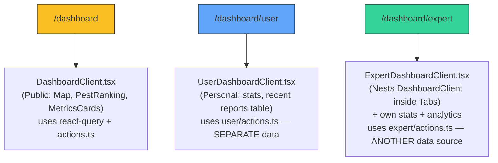
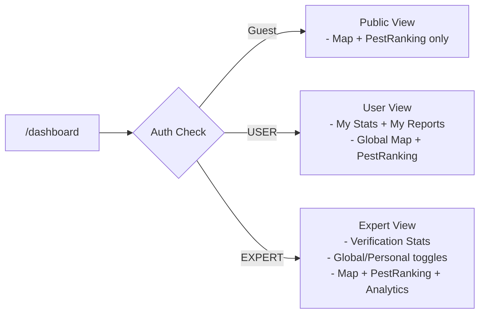

# Dashboard V2 — Restructure for User & Expert

## Problem Analysis

The current dashboard code has **3 overlapping, confusing systems**:

### Key Confusion Points

| Problem | Detail |
|---------|--------|
| **3 separate data sources** | `actions.ts` (root), `user/actions.ts`, `expert/actions.ts` each fetch data differently |
| **Inconsistent features** | User dashboard has NO map, NO pest ranking. Expert has map but inside nested component |
| **Redundant components** | Expert wraps root's `DashboardClient` inside its own component — nested and confusing |
| **Middleware routing complexity** | `/dashboard` → middleware checks role → redirects to `/dashboard/user` or `/dashboard/expert` |
| **User dashboard is too basic** | Only shows stats counts + a report table — feels like a different app |

---

## Proposed Architecture: Unified Dashboard with Tab-Based Role Views

> [!IMPORTANT]
> **Core Idea**: One unified dashboard page (`/dashboard`) that shows relevant content based on user role. No more separate route folders for `user/` and `expert/`.

### What Each Role Sees

#### 🟢 User Dashboard

1. **My Stats** — Total reports, verified reports (2 cards)
2. **My Recent Reports** — Table with status badges (reuse existing)
3. **Global Overview** — Map + Pest Ranking (reuse shared components)
4. **Quick Actions** — "New Report" button, "Export CSV"

#### 🔵 Expert Dashboard

Everything User sees, plus:

1. **Verification Stats** — Verified today/week/total (3 cards)
2. **Global/Personal Toggle** — Switch between all data and personal data
3. **Analytics Tab** — Reports by province/pest, daily trend chart

---

## Proposed Changes

### Dashboard Core

#### [MODIFY] [page.tsx](file:///d:/Github/pestdatabaseweb0402/src/app/dashboard/page.tsx)

- Fetch user role (if authenticated) and pass as prop to client
- Single server component that determines the view

#### [MODIFY] [DashboardClient.tsx](file:///d:/Github/pestdatabaseweb0402/src/app/dashboard/DashboardClient.tsx)

- Add `role` prop (`"guest" | "user" | "expert"`)
- Add `userProfile` prop for authenticated users
- Render role-appropriate sections:
  - Guest: map + pest ranking only
  - User: personal stats → recent reports → map + pest ranking
  - Expert: verification stats → toggle → tabs (overview + analytics) → map + pest ranking

#### [MODIFY] [actions.ts](file:///d:/Github/pestdatabaseweb0402/src/app/dashboard/actions.ts)

- Add `getUserDashboardData()` (merge from `user/actions.ts`)
- Add `getExpertStats()` (merge from `expert/actions.ts`)
- Consolidate into one data source

---

### Middleware

#### [MODIFY] [middleware.ts](file:///d:/Github/pestdatabaseweb0402/src/lib/supabase/middleware.ts)

- Remove redirect logic that sends `/dashboard` → `/dashboard/user` or `/dashboard/expert`
- `/dashboard` stays as `/dashboard` for all roles
- Keep protection on `/dashboard/admin` only

---

### Cleanup (After Verification)

#### [DELETE] `src/app/dashboard/user/` (entire folder)

- Functionality merged into main `DashboardClient.tsx`

#### [DELETE] `src/app/dashboard/expert/` (entire folder)

- Functionality merged into main `DashboardClient.tsx`

---

## Verification Plan

### Manual Testing (User to perform)

1. **Guest (not logged in)**: Visit `http://localhost:3000/dashboard`
   - Should see map + pest ranking only, no personal data
2. **Login as USER** (`reporter1@demo.com`): Should see `/dashboard` with:
   - Personal stats cards, recent reports table, global map, pest ranking
3. **Login as EXPERT**: Should see `/dashboard` with:
   - Verification stats, global/personal toggle, analytics tab, map
4. **Login as ADMIN**: Should redirect to `/dashboard/admin` (unchanged)

### Build Check

- Run `npm run build` to ensure no compile errors after refactoring

---

## Questions for You

1. **Do you want the User to also see the Global Map and Pest Ranking**, or keep it simple with only personal data? (I recommend including global data — it gives more context)
2. **Should the Expert's "Analytics" tab stay**, or would you prefer a simpler layout without tabs?
3. **Any specific design/visual references** you'd like the new dashboard to follow?
